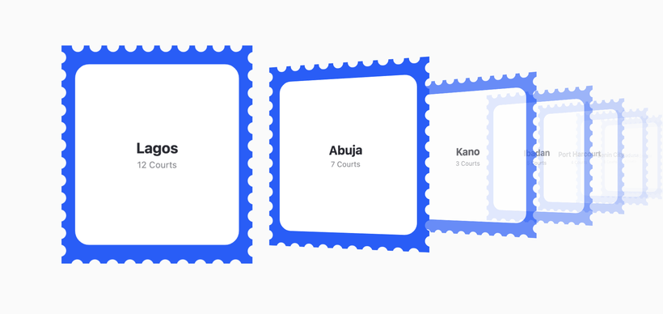

<p align="center">
  <strong>stampstack</strong>
</p>

<p align="center">
  A draggable 3D coverflow of scalloped postage-stamp cards.<br/>
  Bring your own content — the library owns the frame and the fan, you fill the stamp.
</p>

<p align="center">
  <strong>Zero deps. ~5KB gzipped. React 18+.</strong>
</p>

<p align="center">
  
</p>

## Quick Start

```bash
npm install stampstack
```

```tsx
import { StampStack } from 'stampstack'
import 'stampstack/styles.css'

// Your data — each item only needs an `id`. Everything else is yours.
const items = [
  { id: 'a', title: 'First' },
  { id: 'b', title: 'Second' },
  { id: 'c', title: 'Third' },
]

<StampStack
  items={items}
  renderStamp={(item, state) => (              // fill each stamp with your own DOM
    <div style={{ opacity: state.focused ? 1 : 0.8 }}>{item.title}</div>
  )}
  // ── all optional ───────────────────────────────────────────────
  onSelect={(item, index) => {}}               // open a card on tap (omit = non-interactive)
  frameColor={(item) => '#295df6'}             // per-stamp frame color
  onFocusChange={(index) => {}}                // focused card changed
  initialIndex={0}                             // which card starts focused (default 0)
  cardWidth={260}                              // card width in px (default 260)
  // className / style are forwarded to the root .stampstack element
/>
```

`renderStamp` receives a `state` of `{ focused, index, offset }` — use it to dim,
hide, or swap detail on non-focused cards. The library renders **no text and no
font**; your content brings its own.

**Controls:** drag / flick to move through the fan; arrow keys (← →) move focus.

## Clickable stamps

Stamps are non-interactive by default. Pass `onSelect` to make them tappable:

```tsx
<StampStack
  items={items}
  onSelect={(item, index) => router.push(`/p/${item.id}`)}
  renderStamp={(item) => <div>{item.title}</div>}
/>
```

`onSelect` fires for the **visually front-most card under the pointer** — accurate
even for rotated, overlapping fanned cards, because the library does its own
hit-testing instead of trusting the browser's 3D guess. It **never fires after a
drag**, and cards become keyboard-activatable (Tab to a card + Enter/Space, or Enter
opens the focused card). Omit `onSelect` and stamps are inert.

## Theming

Import `stampstack/styles.css`, then override any CSS variable on `.stampstack`:

```css
.stampstack {
  --stampstack-frame: #295df6;                           /* frame color */
  --stampstack-card-bg: #fff;                            /* inner "paper" color */
  --stampstack-text: #2a2b32;                            /* default text (inherited; flips in dark) */
  --stampstack-radius: 21px;                             /* inner card corner radius */
  --stampstack-ease: cubic-bezier(0.25, 0.46, 0.45, 0.94); /* snap transition curve */
  --stampstack-perspective: 1200px;                      /* 3D depth (smaller = more dramatic) */
}
```

The scalloped stamp silhouette is fixed — it's the signature. You can recolor and
restyle everything else, but you can't reshape it.

## Dark mode

Add `data-theme="dark"` on `.stampstack` (or any ancestor — e.g. `<body>` or your
app's theme wrapper):

```html
<body data-theme="dark"> … </body>
```

It themes the **paper** (to an elevated charcoal) and flips the default **text
color** to light — so plain `renderStamp` text that doesn't hard-code its own
`color` adapts automatically. The library themes only what it owns (paper, default
text); the page background and any explicitly-colored content stay yours.

## Acknowledgment

- Drag / flick release behavior adapted from [Swiper](https://swiperjs.com)'s coverflow.
- API and README shape inspired by [cobe](https://github.com/shuding/cobe).

## License

The MIT License.
